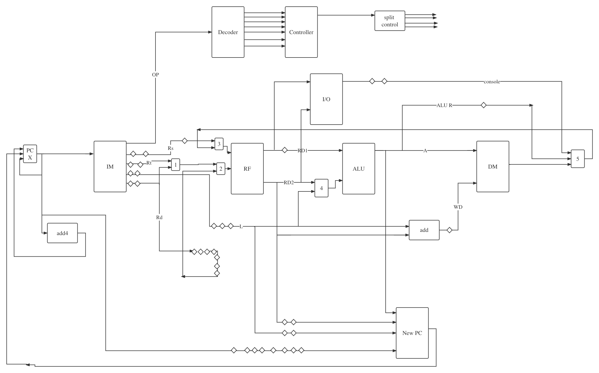
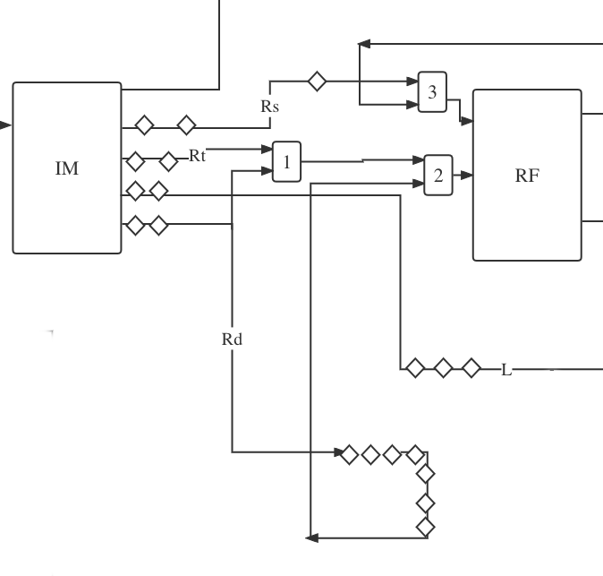
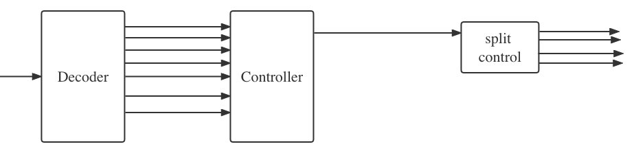
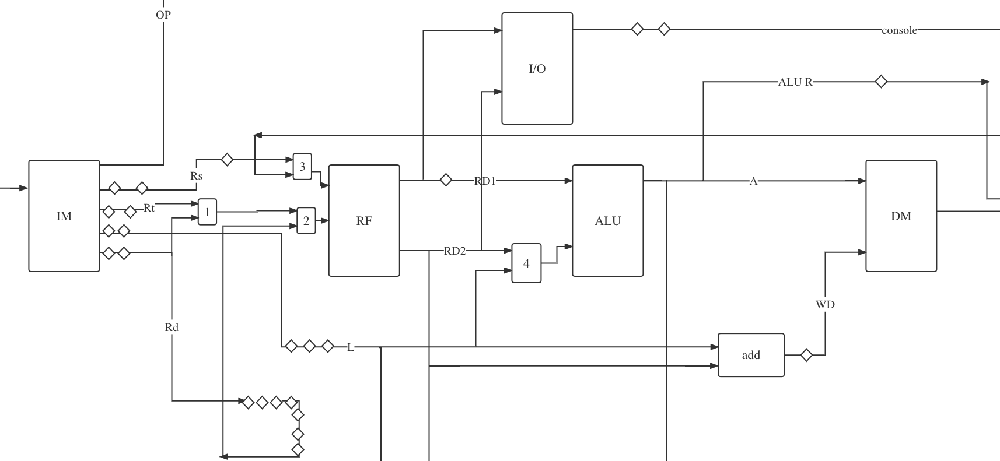
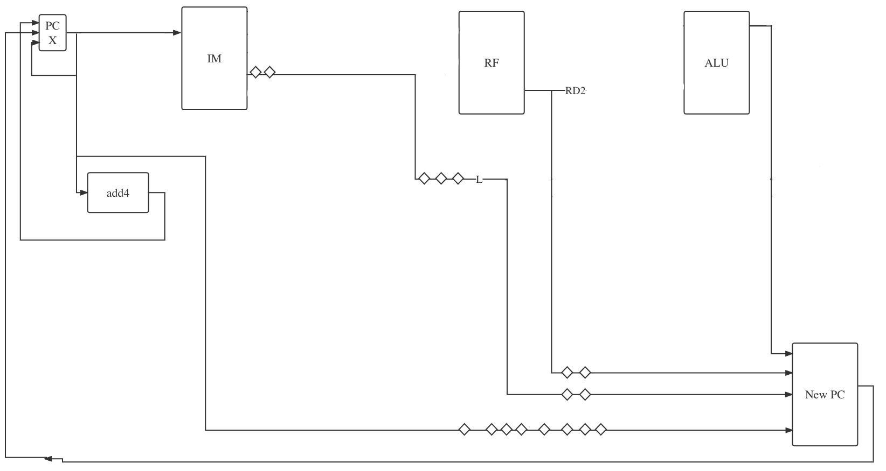

# CS294V_Project
Tinker : CPU simulator

This project implements a C++ simulator based for a CPU called "Tinker". The simulated architecture is as illustrated in the figure below.



The architecture is inheredetly similar to the RISC-V architecture. The main similarility is based in the central block that is composed an Instruction Memory (IM) that provides the instructions driven by a Program Counter (PC), a Register File (RF) made of 32 64bits-registers, an Arithmetic Logic Unit (ALU) that performs all the arithmetical and the logical operations, and a Data Memory that holds the data in runtime.

The components named in numbers 1 to 4 are muxes. They are assigned these numbers for easiness of tracking in the simulator core. The diamonds are buffering registers used plugged in the data paths to ensure the synchronization of the different operations being executed in the components of the processor.



As illustrated in the figure above, the component numbered in 1 is a mux that choses between the two inputs `Rt` and `Rd`. The diamonds on the path that connects `Rt` to the mux are registers used to buffer the signal comming from `Rt` for 2 cycles while waiting for the control signal to arrive (the controls will be discussed later).



The control part in the figure above is used to orchastrate the work of the diffrent components of the CPU using a Decoder that receives the instruction from the IM, transforming it into a sequence of control signals and forwarding them to the Controller that will emit them one by one every cycle. The control signal that comes out of the Controller is splitted to drive every component seperately.

## Artifact evaluation

In order to run the simulator, the following commands have to be run on a Linux/MacOS system.

` ` `
git clone --branch final-beautified https://github.com/YangZiyi121/Project_294.git

g++ Main.cpp Device.cpp Latch.cpp Port.cpp -o tinker -w

./tinker
` ` `

## Data Path



The data path of the CPU is composed of an Instruction Memory (IM), a Register File (RF), an Arithmetic Logic Unit (ALU), and a Data Memory (DM).

The IM has 5 outputs. The first output is the `OP` signal that forwards the OPERATION CODE to the control section. The outputs `Rs` and `Rt` are the operand of several operations. The `Rt` is multiplexed with another output `Rd` (Destination) as the RF is only dual-ported and `Rs` is the required signal when operations are performed with an immediate value sent on another output `L`. Notably, the `Rd` is again multiplexed in the mux number 2 as it would be required when `Rs` and `Rt` are sent to computation and the value of `Rd` is needed for storage.

The RF has two outputs `RD1` and `RD2`. Those will be either used with the IO components, or with ALU. In case of use with the IO components, one will be used to select the IO component and the other will be used to read from or write to it. In case of use with the ALU, both will be used as operands of the operations sent by the Controller. Notably, the `RD2` is multiplexed with the immediate comming in signal `L` using the mux numbered 4.

The DM receives an address from the ALU. In case the Controller sends a read control signal, then the DM outputs the value stored at the sent address. Otherwise, if the Controller sends a write control signal, then the DM writes the value comming from the component "add" below it that sums the `RD2` and `L` (different combination of those is handled by the control signals) and outputs nothing. 

Finally, whatever is comming from the IO, ALU, or DM, they will be multiplexed by the mux numbered 5 and depending on the control signal one of them is chosen and sent back to the RF to be stored in `Rd` that has been buffering all along the execution.

## Branching Path



The branching path is illustrated in the figure above. Basically, the PC in case of no branching adds up by 4 as the memory is byte addressable and 32 bits are read at once. In case of branching/jumps, the different combinations are handled by the component New PC that receives signals from the IM as immediate through the signal `L` (e.g. instruction `brr L`), the RF as value stored in a register through the signal `RD2` (e.g. instruction `br rd`), or the ALU after some computation (e.g. instruction `brgt rd, rs, rt`).

## Control Path

The control path consists of the Decoder, the Controller, and the Split control. The Decoder receives the operation code from the IM that will be translated into sequence of control signals. For instance, it receives `0x0` that is specific to the instruction `add rd, rs, rt` and translates it in to ```{0b00000000000000000, 0b00000000000000000
                    , 0b00000100000000000
                    , 0b00000010000000000 
                    , 0b00000000001000000
                    , 0b00000000000000000
                    , 0b00000000000000001
                    , 0b00110000000000000
                    , 0b00001100000000000}```. More about decoding each instruction could be found in [Control signals](./Control_signals.pdf).
                    
The control binary word is as follows `[PC_1b, MUX1_1b, MUX_1b, MUX3_1b, RF_2b, MUX4_1b, ALU_4b, IO_2b, DM_2b, MUX5_2b]` where `XX_yb` is seen as the component `XX` and `y` is the number of control bits it receives.

For all the components, the control signals corresponding values are given in the source code files.
